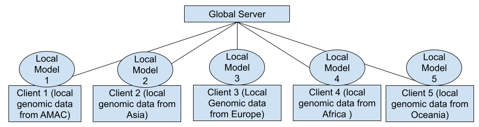

# Protein modeling for combinatorial mutations

## Problem

Predicting the phenotype of combinatorial mutations based on single mutation data.
Features: Height, Hair Color

## Dataset
* Source: SNP data
* [1000 Genomes](https://registry.opendata.aws/1000-genomes/)

## Federation -> clients

### Data Preprocessing

* reducing dimensionality

### Model Structure

* Baseline model: Linear Regression
* Ensemble model: Tree-based models (Random Forest Classifier/XGBoost/LightGBM)
* Neural Network: for feature interactions/ epistasis

## Tools

## Implementation

## Usage

* Discrete Phenotype
* Continuous Phenotype

## Some Extended References

* [BioNeMo](https://github.com/NVIDIA/bionemo-framework)
* [Amplify](https://github.com/NVIDIA/NVFlare/tree/main/examples/advanced/amplify)

