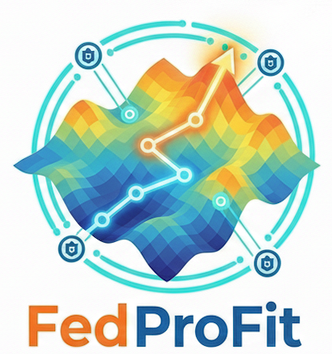

<div align="center">
  

  <h1>FedProFit: Federated Protein Fitness</h1>
  
  <h3>
    Federated Prediction of Combinatorial Protein Sequence Mutation Effects on Protein Function using BioNeMo and NVIDIA Flare.
  </h3>

  <p>
    <strong>Predicting Deep Mutational Scanning (DMS) scores using Pre-trained Protein Language Models in a Federated Environment.</strong>
  </p>

  <p>
    <a href="latexcode/main.pdf">
      
    </a>
    <a href="https://www.python.org/">
      
    </a>
    <a href="https://pytorch.org/">
      
    </a>
  </p>
</div>

<br/>

## What Problem Does This Solve?

Predicting the functional effects of combinatorial mutations is a critical challenge in protein engineering and evolutionary biology. While Deep Mutational Scanning (DMS) provides ground-truth fitness landscapes, the data faces two major challenges:

1. **Siloed Data:** DMS data is distributed across different institutions (hospitals, academic labs, industry), each with proprietary or sensitive datasets that cannot be easily shared.
2. **Sparse Coverage:** The combinatorial space of mutations is astronomically vast, making exhaustive experimental characterization infeasible.

**FedProFit** addresses these challenges by enabling collaborative machine learning across distributed DMS datasets **without sharing raw sequence data**. Our framework leverages federated learning to train predictive models that benefit from diverse biological datasets while maintaining data privacy and ownership.


---

## How to Use

### Prerequisites

* Python 3.8+
* PyTorch
* NVIDIA BioNeMo Framework (or HuggingFace Transformers for ESM-2)
* NVIDIA FLARE (nvflare) for Federated Learning orchestration

### Installation

```bash
git clone https://github.com/your-username/FedProFit.git
cd FedProFit
pip install -r requirements.txt
```

### Quick Start

**1. Start the Federated Learning Server:**

The server orchestrates the aggregation of model weights across all clients.

```bash
python server.py --rounds **[TODO: specify number of communication rounds, e.g., 10]** --port **[TODO: specify port number, e.g., 8080]**
```

**2. Start the Federated Clients:**

Open separate terminals for each client to simulate distributed nodes. Each client corresponds to a specific biological domain.

```bash
# Terminal 1: Human/Clinical Node
python client.py --client_id 1 --taxon Human --data_path **[TODO: path to Human domain data]**

# Terminal 2: Virus Node
python client.py --client_id 2 --taxon Virus --data_path **[TODO: path to Virus domain data]**

# Terminal 3: Prokaryote Node
python client.py --client_id 3 --taxon Prokaryote --data_path **[TODO: path to Prokaryote domain data]**

# Terminal 4: Eukaryote Node
python client.py --client_id 4 --taxon Eukaryote --data_path **[TODO: path to Eukaryote domain data]**
```

### Federated Learning Protocol

The training process follows the Federated Averaging (FedAvg) algorithm:

1. **Initialization**: The central server initializes the weights of the prediction head and distributes them to all clients. The BioNeMo backbone is pre-loaded on all clients.

2. **Local Training**: Each client trains the prediction head on their local data for **[TODO: specify number of local epochs, e.g., 5]** epochs. The loss function is Mean Squared Error (MSE) between predicted and actual DMS scores, optimized using AdamW with learning rate **[TODO: specify learning rate, e.g., 1e-4]**.

3. **Aggregation**: Clients send only the updated weights of the prediction head back to the server. The server performs weighted averaging of these weights to create a new global model, where weights are proportional to the number of training samples per client.

4. **Distribution**: The updated global model is sent back to clients for the next round of federated training.

This process repeats for the specified number of communication rounds until convergence.

### Model Configuration

**BioNeMo Backbone:**
- Model: **[TODO: specify model name, e.g., ESM-2 or MegaMolBART]**
- Input: Amino acid sequence of the mutant protein
- Output: Per-residue or whole-sequence embeddings
- Status: Frozen (weights not updated during training)

**Prediction Head (MLP):**
- Number of layers: **[TODO: specify, e.g., 2 or 3 layers]**
- Hidden dimensions: **[TODO: specify, e.g., 512, 256]**
- Activation functions: **[TODO: specify, e.g., ReLU, GELU]**
- Pooling method: **[TODO: specify, e.g., mean pooling or CLS token]**
- Output: Single scalar value representing predicted DMS score

### Evaluation

After training, evaluate the model performance:

```bash
python evaluate.py --model_path **[TODO: path to trained model]** --test_data **[TODO: path to test data]**
```

Metrics include:
- Spearman's rank correlation coefficient
- Pearson correlation
- Mean Squared Error (MSE)
- Mean Absolute Error (MAE)

---

## Dataset

To ensure consistent input across all federated clients, we utilize the standardized processed files from the **[ProteinGym](https://proteingym.org/) Substitution Benchmark**. This benchmark comprises approximately **2.4 million missense variants** across **217 DMS assays**.


Each dataset in our simulation corresponds to a single DMS assay and adheres to the following schema:

| Variable | Type | Description |
| --- | --- | --- |
| **`mutant`** | `str` | A colon-separated string describing the amino acid changes relative to the reference sequence (e.g., **`A1P:D2N`** implies Alanine at position 1 → Proline, and Aspartic Acid at position 2 → Asparagine). |
| **`mutated_sequence`** | `str` | The full, explicit amino acid sequence of the variant protein. This serves as the primary input for the BioNeMo feature extractor. |
| **`DMS_score`** | `float` | The experimental ground-truth value. A higher score indicates higher fitness (or functional retention) of the mutated protein. This is the regression target for our model. |
| **`DMS_score_bin`** | `int` | A binarized classification label based on assay-specific fitness cutoffs (`1` = fit/pathogenic; `0` = not fit/benign). |

In addition to the raw sequence data, we leverage ProteinGym reference files to partition data by biological domain. Key metadata includes:

* `UniProt ID`: Unique protein identifier.
* `Taxon`: (e.g., *Human*, *Virus*, *Prokaryote*, *Eukaryote*) Used to assign datasets to the appropriate Federated Client node.
* `MSA Depth`: Categorical depth of the Multiple Sequence Alignment (Low, Medium, High), used to balance difficulty across clients.

### Federated Clients Simulation

To simulate a realistic cross-institutional collaboration, we partition the full ProteinGym Substitution Benchmark into four distinct client nodes based on biological domain (`Taxon`). We aggregate all available assays corresponding to a specific taxon into a single client node, ensuring that each client possesses a comprehensive and heterogeneous local dataset rather than a single representative protein.

| Node | Client Type | Simulation Scenario |
| --- | --- | --- |
| **Client 1** | **Human** | **Clinical Hospital / Oncology** |
| **Client 2** | **Virus** | **Virology Lab / Pandemic Prep** |
| **Client 3** | **Prokaryote** | **Antibiotic Resistance Lab** |
| **Client 4** | **Eukaryote** | **Academic Bio-Foundry** |


---

## Model Architecture

We utilize a **Hydra** approach (also known as a frozen shared backbone with local heads), which is a **Transfer Learning** strategy with a frozen backbone and locally trainable prediction heads. This architecture pattern allows each client to maintain a shared frozen feature extractor while training personalized prediction heads locally.

### Frozen Backbone (BioNeMo)

* We use a pre-trained Protein Language Model (e.g., ESM-2 or MegaMolBART via NVIDIA BioNeMo) as the encoder.
* **Input:** Amino acid sequence of the mutant (e.g., `M1A, ...`).
* **Output:** Per-residue or whole-sequence embeddings.
* *Note:* All weights in this encoder are **frozen** to reduce communication overhead and computational requirements on edge clients.

### Trainable Prediction Head (Added Locally)

* The prediction head is added locally on each client and consists of:
  * **Pooling Layer:** Aggregates the sequence embedding (using Mean Pooling or the `<CLS>` token representation) into a fixed-size vector.
  * **Regression MLP:** A multi-layer perceptron (MLP) stacked on top of the pooled embeddings. This MLP is trainable and is added locally to each client, allowing for local adaptation while keeping the BioNeMo backbone frozen.
  * **Architecture Details:** **[TODO: To be specified: number of layers, hidden dimensions, activation functions]**
* **Output:** A single scalar value representing the predicted DMS score.
* *Note:* By keeping the BioNeMo backbone frozen and only training the MLP prediction head locally, we ensure that only the lightweight prediction head weights need to be communicated during federated learning, significantly reducing communication overhead. This Hydra architecture enables efficient federated learning by sharing the computationally expensive feature extraction while allowing local personalization of the prediction head.

---

## Results

> **⚠️ TODO:** Results to be updated based on final experimental outcomes

* **Evaluation Metrics:** Spearman's Rank Correlation, Pearson Correlation, Mean Squared Error (MSE), Mean Absolute Error (MAE)
* **Global Performance:** After **[TODO: specify number of rounds]** rounds of federated training, the global model performance compared to baselines
* **Baseline Comparisons:** Local Training Only, Centralized Training, Pre-trained Model Only

| Model | Client 1 (Human) | Client 2 (Virus) | Client 3 (Prokaryote) | Client 4 (Eukaryote) | Average  |
| --- | --- | --- | --- | --- | --- |
| Local Training Only | `TBD` | `TBD` | `TBD` | `TBD` | `TBD` |
| **Federated (FedProFit)** | **`TBD`** | **`TBD`** | **`TBD`** | **`TBD`** | **`TBD`** |

---

## Acknowledgements

* [ProteinGym](https://proteingym.org/) for the benchmarking datasets.
* [NVIDIA BioNeMo](https://www.nvidia.com/en-us/clara/bionemo/) for the foundational protein models.
* [NVIDIA FLARE](https://github.com/NVIDIA/NVFlare) for the federated learning infrastructure.

## Team Members

- Bhanvi Paliwal
- Caiwei (Maggie) Zhang
- Jiayi Zhao
- Sihyun Park
- Sumeet Kothare
- Ushta Samal
