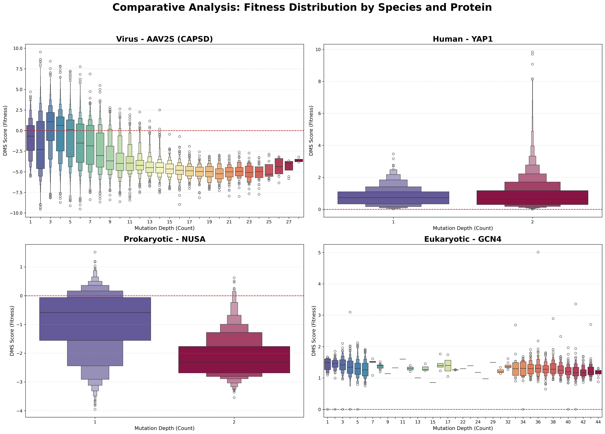
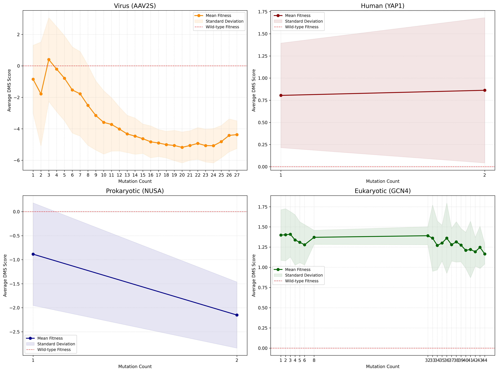
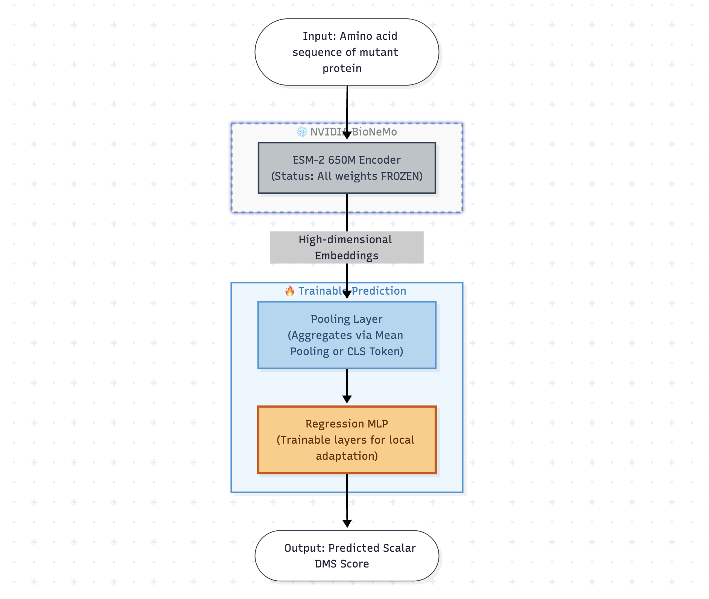

<div align="center">
  

  <h1>FedProFit: Federated Protein Fitness</h1>
  
  <h3>
    Federated Prediction of Combinatorial Protein Sequence Mutation Effects on Protein Function using BioNeMo and NVIDIA Flare.
  </h3>

  <p>
    <strong>Predicting Deep Mutational Scanning (DMS) scores using Pre-trained Protein Language Models in a Federated Environment.</strong>
  </p>

  <p>
    <a href="latexcode/main.pdf">
      
    </a>
    <a href="https://www.python.org/">
      
    </a>
    <a href="https://pytorch.org/">
      
    </a>
    <a href="https://github.com/NVIDIA/NVFlare">
      
    </a>
    <a href="https://www.nvidia.com/en-us/clara/bionemo/">
      
    </a>
  </p>
</div>

<br/>

## What Problem Does This Solve?

Predicting the functional effects of combinatorial mutations is a critical challenge in protein engineering and evolutionary biology. While Deep Mutational Scanning (DMS) [[1]](#references) provides ground-truth fitness landscapes, the data faces two major challenges:

1. **Siloed Data:** DMS data is distributed across different institutions (hospitals, academic labs, industry), each with proprietary or sensitive datasets that cannot be easily shared.
2. **Sparse Coverage:** The combinatorial space of mutations is astronomically vast, making exhaustive experimental characterization infeasible.

**FedProFit** addresses these challenges by enabling collaborative machine learning across distributed DMS datasets **without sharing raw sequence data**. Our framework leverages federated learning [[2]](#references) to train predictive models that benefit from diverse biological datasets while maintaining data privacy and ownership.


---

## How to Use

> 📖 **For detailed setup instructions, see [SETUP.md](SETUP.md)** — This includes step-by-step guide for Docker setup, model fetching, data preparation, and training.

### Prerequisites

* Python 3.8+
* PyTorch
* NVIDIA BioNeMo Framework (ESM-2 via NVIDIA NGC)
* NVIDIA FLARE (nvflare) for Federated Learning orchestration
* Docker (for BioNeMo containerized environment)
* NVIDIA NGC Account with API Key

### Quick Start

#### 1. Environment Setup

Follow the detailed setup guide in **[SETUP.md](SETUP.md)** to:
- Set up the BioNeMo Docker container
- Install dependencies (NVFlare, BioNeMo)
- Configure the environment

#### 2. Fetch Pre-trained Model

Download the ESM-2 650M checkpoint from NVIDIA NGC:

```bash
# Inside the BioNeMo Docker container
python fetch_model.py
```

This will download and place the model at `/workspace/project/esm2_650m.nemo`.

#### 3. Prepare Data

Split your data into train/val/test sets:

```bash
# Inside the BioNeMo Docker container
cd /workspace/project/data
python make_splits.py
```

This creates processed data in `/workspace/project/data/splits/` organized by domain (human, virus, prokaryote, eukaryote).

#### 4. Training Options

**Centralized Training:**

```bash
# Inside the BioNeMo Docker container
chmod +x run_centralized_training.sh
./run_centralized_training.sh
```

**Federated Training:**

```bash
# Inside the BioNeMo Docker container
cd federated
# See federated/run_federated_training.sh for federated setup
```

For detailed federated learning protocol and configuration, see **[SETUP.md](SETUP.md#-centralized-esm-2-fine-tuning-end-to-end-workflow)**.

#### 5. Evaluation

Evaluate model performance using the analysis scripts:

```bash
# Inside the BioNeMo Docker container
python analysis/evaluate_model.py \
    --model_path ./results/run_centralized_human/best.ckpt \
    --test_data ./data/splits/human/test.csv
```

**Metrics:**
- Spearman's rank correlation coefficient
- Pearson correlation
- Mean Squared Error (MSE)
- Mean Absolute Error (MAE)

> 📐 **For detailed model architecture information, see the [Model Architecture](#model-architecture) section below.**

---

## Dataset

To ensure consistent input across all federated clients, we utilize the standardized processed files from the **[ProteinGym](https://proteingym.org/) Substitution Benchmark** [[3]](#references). This benchmark comprises approximately **2.4 million missense variants** across **217 DMS assays**.


Each dataset in our simulation corresponds to a single DMS assay and adheres to the following schema:

| Variable | Type | Description |
| --- | --- | --- |
| **`mutant`** | `str` | A colon-separated string describing the amino acid changes relative to the reference sequence (e.g., **`A1P:D2N`** implies Alanine at position 1 → Proline, and Aspartic Acid at position 2 → Asparagine). |
| **`mutated_sequence`** | `str` | The full, explicit amino acid sequence of the variant protein. This serves as the primary input for the BioNeMo feature extractor. |
| **`DMS_score`** | `float` | The experimental ground-truth value. A higher score indicates higher fitness (or functional retention) of the mutated protein. This is the regression target for our model. |
| **`DMS_score_bin`** | `int` | A binarized classification label based on assay-specific fitness cutoffs (`1` = fit/pathogenic; `0` = not fit/benign). |

In addition to the raw sequence data, we leverage ProteinGym reference files to partition data by biological domain. Key metadata includes:

* `UniProt ID`: Unique protein identifier.
* `Taxon`: (e.g., *Human*, *Virus*, *Prokaryote*, *Eukaryote*) Used to assign datasets to the appropriate Federated Client node.
* `MSA Depth`: Categorical depth of the Multiple Sequence Alignment (Low, Medium, High), used to balance difficulty across clients.

The datasets exhibit varying characteristics across biological domains, as illustrated by the following analyses:



*Distribution of species and proteins across different taxa (Human, Virus, Prokaryote, Eukaryote) in the ProteinGym benchmark.*

---

### Federated Clients Simulation

To simulate a realistic cross-institutional collaboration, we partition the full ProteinGym Substitution Benchmark into four distinct client nodes based on biological domain (`Taxon`). We aggregate all available assays corresponding to a specific taxon into a single client node, ensuring that each client possesses a comprehensive and heterogeneous local dataset rather than a single representative protein.

| Node | Client Type | Simulation Scenario |
| --- | --- | --- |
| **Client 1** | **Human** | **Clinical Hospital / Oncology** |
| **Client 2** | **Virus** | **Virology Lab / Pandemic Prep** |
| **Client 3** | **Prokaryote** | **Antibiotic Resistance Lab** |
| **Client 4** | **Eukaryote** | **Academic Bio-Foundry** |


---

## Model Architecture

We utilize a **Hydra** approach [[4]](#references) with a frozen backbone and locally trainable prediction heads, enabling efficient federated learning while reducing communication overhead.



**Frozen Backbone (BioNeMo):**
- ESM-2 650M (via NVIDIA BioNeMo [[5]](#references))
- Input: Amino acid sequence → Output: Protein embeddings
- Status: Frozen (see `--encoder-frozen` flag)

**Trainable Prediction Head:**
- Pooling layer + Regression MLP (added locally per client)
- Output: Predicted DMS score
- Only prediction head weights are communicated during federated learning

For detailed configuration, see **[SETUP.md](SETUP.md#3-training-the-execution-script)**.

---

## Results

FedProFit framework has been successfully developed and implemented. The system enables prediction of DMS scores for combinatorial mutations across distributed datasets, with the federated learning infrastructure operational and ready for multi-institutional collaboration.

### Local Training Performance

We evaluated the model architecture using local training across different biological domains:

| Domain | Human | Virus | Prokaryote | Eukaryote |
| --- | --- | --- | --- | --- |
| Validation MSE | 0.956 | 3.331 | 3.504 | N/A* |

*Eukaryote domain excluded due to data quality issues (NaN or invalid DMS scores in validation set)*

### Federated Learning Framework

The **FedProFit** federated learning framework is fully implemented and operational. The system successfully:
- Coordinates training across multiple federated clients
- Aggregates model weights while preserving data privacy
- Handles non-IID data distribution across biological domains (Human, Virus, Prokaryote, Eukaryote)

---

## Future Directions

The primary focus is on completing and enhancing the federated learning framework:

**1. Complete Federated Learning Evaluation**
   - Conduct full multi-round federated training experiments across all four biological domains
   - Evaluate federated model performance against local training baselines using comprehensive metrics (Spearman's correlation, Pearson correlation, MSE, MAE)
   - Analyze convergence behavior and communication efficiency across different numbers of federated rounds

**2. Advanced Federated Learning Algorithms**
   - Explore algorithms such as FedProx [[7]](#references) or SCAFFOLD [[8]](#references), to better handle non-IID data distribution across biological domains
   - Implement adaptive aggregation strategies that account for domain-specific data heterogeneity

**3. Federated Framework Enhancements**
   - Address Eukaryote domain data quality issues to enable full four-client federated training
   - Implement robust handling of client dropout and asynchronous updates for real-world deployment scenarios
   - Add support for dynamic client participation and heterogeneous compute resources

---

## Acknowledgements

* [ProteinGym](https://proteingym.org/) [[3]](#references) for the benchmarking datasets.
* [NVIDIA BioNeMo](https://www.nvidia.com/en-us/clara/bionemo/) [[5]](#references) for the foundational protein models.
* [NVIDIA FLARE](https://github.com/NVIDIA/NVFlare) [[6]](#references) for the federated learning infrastructure.
* FedProFit logo designed using Gemini NanoBanana with our specifications.

## Team Members

- Bhanvi Paliwal
- Caiwei (Maggie) Zhang
- Jiayi Zhao
- Sihyun Park
- Sumeet Kothare
- Ushta Samal

---

## References

[1] Fowler, D. M., & Fields, S. (2014). Deep mutational scanning: a new style of protein science. *Nature Methods*, 11(8), 801-807. https://doi.org/10.1038/nmeth.3027

[2] McMahan, H. B., Moore, E., Ramage, D., & y Arcas, B. A. (2016). Federated Learning of Deep Networks using Model Averaging. *arXiv preprint arXiv:1602.05629*. http://arxiv.org/abs/1602.05629

[3] Notin, P., Kollasch, A. W., Ritter, D., et al. (2023). ProteinGym: Large-Scale Benchmarks for Protein Design and Fitness Prediction. *bioRxiv*. https://doi.org/10.1101/2023.12.07.570727

[4] Yadan, O. (2019). Hydra - A framework for elegantly configuring complex applications. *GitHub*. https://github.com/facebookresearch/hydra

[5] St. John, P., Lin, D., Binder, P., et al. (2025). BioNeMo Framework: a modular, high-performance library for AI model development in drug discovery. *arXiv preprint arXiv:2411.10548*. https://arxiv.org/abs/2411.10548

[6] Roth, H. R., Cheng, Y., Wen, Y., et al. (2022). NVIDIA FLARE: Federated Learning from Simulation to Real-World. *arXiv preprint arXiv:2210.13291*. https://doi.org/10.48550/arXiv.2210.13291

[7] Li, T., Sahu, A. K., Zaheer, M., Sanjabi, M., Talwalkar, A., & Smith, V. (2020). Federated Optimization in Heterogeneous Networks. *arXiv preprint arXiv:1812.06127*. https://arxiv.org/abs/1812.06127

[8] Karimireddy, S. P., Kale, S., Mohri, M., Reddi, S. J., Stich, S. U., & Suresh, A. T. (2021). SCAFFOLD: Stochastic Controlled Averaging for Federated Learning. *arXiv preprint arXiv:1910.06378*. https://arxiv.org/abs/1910.06378
