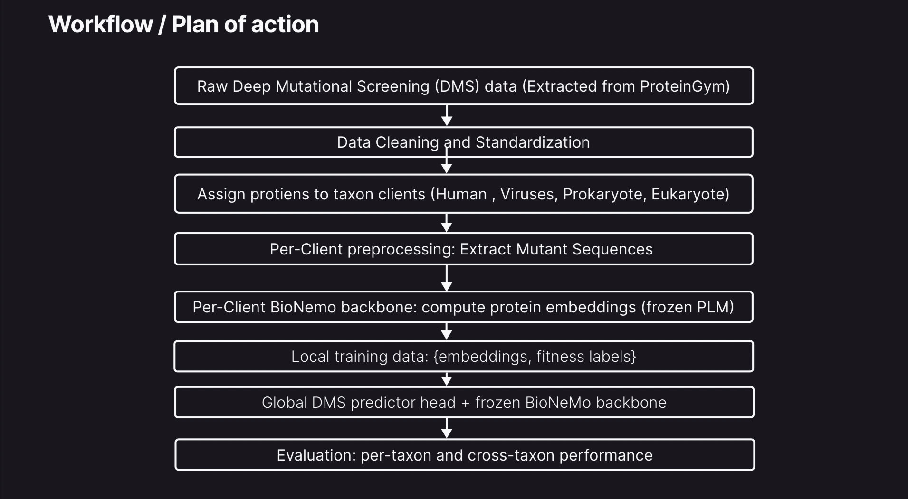
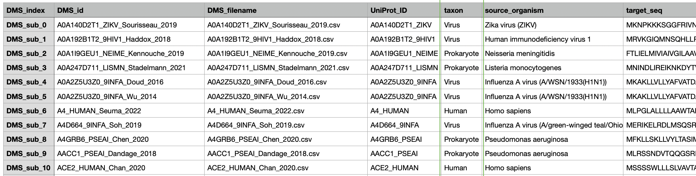
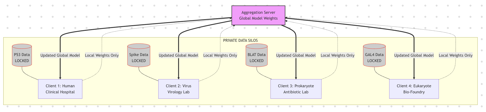

# FedMut: Federated Prediction of Combinatorial Mutation Effects

**Predicting Deep Mutational Scanning (DMS) scores using Pre-trained Protein Language Models in a Federated Environment.**

## Problem

Predicting the functional effects of combinatorial mutations is a critical challenge in protein engineering and evolutionary biology. While Deep Mutational Scanning (DMS) provides ground-truth fitness landscapes, the data is often:

1. **Siloed:** Distributed across different institutions (hospitals, academic labs, industry).
2. **Sparse:** The combinatorial space of mutations is too vast to measure experimentally.

This project addresses these challenges by leveraging **Federated Learning (FL)** to train a predictive model across distributed datasets without sharing raw patient or proprietary sequence data.

## Introduction

We aim to predict the DMS score (fitness/stability) of mutant sequences. By utilizing [NVIDIA BioNeMo](https://github.com/NVIDIA/bionemo-framework) pre-trained models as a feature extractor, we benefit from representations learned on massive protein databases while keeping the computational cost of local training low.



---

## Dataset

To ensure consistent input across all federated clients, we utilize the standardized processed files from the **[ProteinGym](https://proteingym.org/) Substitution Benchmark**. This benchmark comprises approximately **2.4 million missense variants** across **217 DMS assays**.



Each dataset in our simulation corresponds to a single DMS assay and adheres to the following schema:

| Variable | Type | Description |
| --- | --- | --- |
| **`mutant`** | `str` | A colon-separated string describing the amino acid changes relative to the reference sequence (e.g., **`A1P:D2N`** implies Alanine at position 1  Proline, and Aspartic Acid at position 2  Asparagine). |
| **`mutated_sequence`** | `str` | The full, explicit amino acid sequence of the variant protein. This serves as the primary input for the BioNeMo feature extractor. |
| **`DMS_score`** | `float` | The experimental ground-truth value. A higher score indicates higher fitness (or functional retention) of the mutated protein. This is the regression target for our model. |
| **`DMS_score_bin`** | `int` | A binarized classification label based on assay-specific fitness cutoffs (`1` = fit/pathogenic; `0` = not fit/benign). |

In addition to the raw sequence data, we leverage ProteinGym reference files to partition data by biological domain. Key metadata includes:

* `UniProt ID`: Unique protein identifier.
* `Taxon`: (e.g., *Human*, *Virus*, *Prokaryote*, *Eukaryote*) Used to assign datasets to the appropriate Federated Client node.
* `MSA Depth`: Categorical depth of the Multiple Sequence Alignment (Low, Medium, High), used to balance difficulty across clients.

### Federated Clients Simulation

To simulate a realistic cross-institutional collaboration, we partition the full ProteinGym Substitution Benchmark into four distinct client nodes based on biological domain (`Taxon`). We aggregate all available assays corresponding to a specific taxon into a single client node, ensuring that each client possesses a comprehensive and heterogeneous local dataset rather than a single representative protein.

| Node | Client Type | Simulation Scenario |
| --- | --- | --- |
| **Client 1** | **Human** | **Clinical Hospital / Oncology** |
| **Client 2** | **Virus** | **Virology Lab / Pandemic Prep** |
| **Client 3** | **Prokaryote** | **Antibiotic Resistance Lab** |
| **Client 4** | **Eukaryote** | **Academic Bio-Foundry** |



---

## Methodology

### Model Structure

We utilize a **Transfer Learning** approach with a frozen backbone and a locally trainable prediction head.

1. **Frozen Backbone (BioNeMo):**
* We use a pre-trained Protein Language Model (e.g., ESM-2 or MegaMolBART via NVIDIA BioNeMo) as the encoder.
* **Input:** Amino acid sequence of the mutant (e.g., `M1A, ...`).
* **Output:** Per-residue or whole-sequence embeddings.
* *Note:* All weights in this encoder are **frozen** to reduce communication overhead and computational requirements on edge clients.

2. **Trainable Prediction Head (Added Locally):**
* The prediction head is added locally on each client and consists of:
  * **Pooling Layer:** Aggregates the sequence embedding (using Mean Pooling or the `<CLS>` token representation) into a fixed-size vector.
  * **Regression MLP:** A multi-layer perceptron (MLP) stacked on top of the pooled embeddings. This MLP is trainable and is added locally to each client, allowing for local adaptation while keeping the BioNeMo backbone frozen.
* **Output:** A single scalar value representing the predicted DMS score.
* *Note:* By keeping the BioNeMo backbone frozen and only training the MLP prediction head locally, we ensure that only the lightweight prediction head weights need to be communicated during federated learning, significantly reducing communication overhead.


## How to use

### Prerequisites

(need to be updated based on final code)
* Python 3.8+
* PyTorch
* NVIDIA BioNeMo Framework (or HuggingFace Transformers for ESM-2)
* Flower (flwr) for Federated Learning orchestration

### Installation

```bash
git clone https://github.com/your-username/Combinatorial_mutations.git
cd Combinatorial_mutations
pip install -r requirements.txt
```

### Running the Simulation
<!-- 
**1. Start the Server:**
The server orchestrates the aggregation of model weights.

```bash
python server.py --rounds 10

```

**2. Start the Clients:**
Open separate terminals for each client to simulate distributed nodes.

```bash
# Terminal 1: Human/Clinical Node
python client.py --client_id 1 --dataset P53_HUMAN

# Terminal 2: Virus Node
python client.py --client_id 2 --dataset SPIKE_SARS2

# Terminal 3: Prokaryote Node
python client.py --client_id 3 --dataset BLAT_ECOLX

# Terminal 4: Eukaryote Node
python client.py --client_id 4 --dataset GAL4_YEAST

``` -->

## Results

(need to be updated based on final code)

* **Metric:** Spearman's Rank Correlation (or something?) between predicted and ground-truth DMS scores.
* **Global Performance:** After  rounds of federated training, the global model achieves competitive performance compared to centrally trained baselines, while preserving data privacy.

| Model | Client 1 (Human) | Client 2 (Virus) | Client 3 (Prokaryote) | Client 4 (Eukaryote) | Average  |
| --- | --- | --- | --- | --- | --- |
| Local Training Only | 0.XX | 0.XX | 0.XX | 0.XX | 0.XX |
| **Federated (FedMut)** | **0.XX** | **0.XX** | **0.XX** | **0.XX** | **0.XX** |

## Acknowledgements

* [ProteinGym](https://proteingym.org/) for the benchmarking datasets.
* [NVIDIA BioNeMo](https://www.nvidia.com/en-us/clara/bionemo/) for the foundational protein models.

## Team Members

- Bhanvi Paliwal
- Caiwei (Maggie) Zhang
- Jiayi Zhao
- Sihyun Park
- Sumeet Kothare
- Ushta Samal
